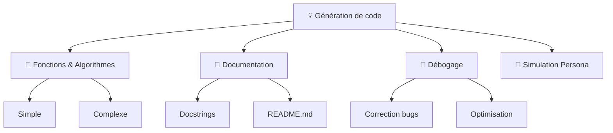
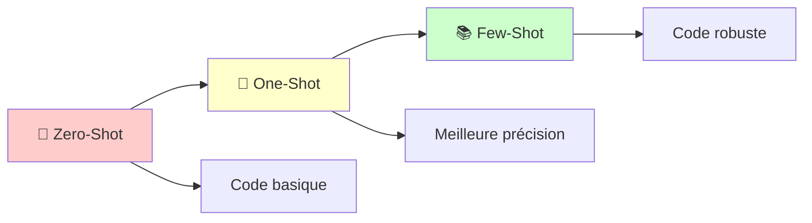
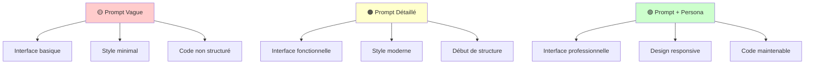
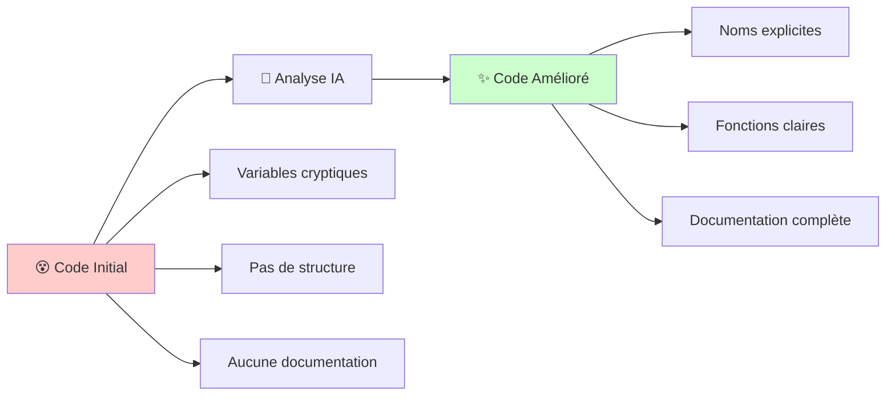
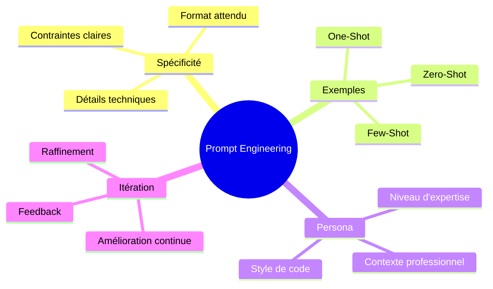

# 🤖💻 TP - Ingénierie de Prompt appliquée à la génération de code avec l'IA

---

## 👩‍🏫 **Encadré par :**

<h3>Prof. Imane Allaouzi</h3>

---

## 🎯 **Objectif du TP**

> Ce TP a pour but d'apprendre à concevoir des **prompts efficaces** pour générer du **code de qualité avec une IA générative**

### 🔥 Principes fondamentaux :

<table>
<tr>
<td align="center">🎯</td>
<td><strong>Tâche</strong></td>
<td>Définir clairement l'objectif</td>
</tr>
<tr>
<td align="center">🌐</td>
<td><strong>Contexte</strong></td>
<td>Fournir le cadre d'utilisation</td>
</tr>
<tr>
<td align="center">📚</td>
<td><strong>Références</strong></td>
<td>Utiliser des exemples concrets</td>
</tr>
<tr>
<td align="center">⚡</td>
<td><strong>Évaluation</strong></td>
<td>Mesurer la qualité du résultat</td>
</tr>
<tr>
<td align="center">🔄</td>
<td><strong>Itération</strong></td>
<td>Améliorer par étapes</td>
</tr>
</table>

---

## 🧠 **Partie 1 – Choix de la solution d'IA générative**

### ✅ **Solution choisie : ChatGPT (OpenAI)**

### 🔍 **Définition brève :**
ChatGPT est un assistant conversationnel développé par OpenAI, capable de générer, corriger, améliorer et expliquer du code à partir de requêtes en langage naturel.

<strong>✔️ Avantages</strong>

- 🚀 Génération rapide de code multi-langage (Python, JS, HTML, etc.)
- 🔧 Peut expliquer les erreurs, refactorer et optimiser du code existant
- 💬 Répond de manière interactive et personnalisée avec contexte

<strong>⚠️ Inconvénients</strong>

- ❌ Peut produire du code incorrect sans prévenir
- 🤔 Ne comprend pas toujours les besoins implicites
- 🔌 Pas d'accès direct à l'environnement de test ou de compilation

### 💼 **Cas d'utilisation typiques :**

---

## 🧠 **Partie 2 – Génération de code avec IA**

### 📊 **Exercice 2.1 : Génération de code Python pour une tâche de calcul**

| Type de Prompt | Qualité du Code | Robustesse | Documentation |
|----------------|-----------------|------------|---------------|
| 🟡 **Prompt Vague** | ⭐⭐ | ⭐ | ⭐ |
| 🟠 **Prompt Spécifique** | ⭐⭐⭐⭐ | ⭐⭐⭐ | ⭐⭐⭐ |
| 🟢 **Prompt avec Persona** | ⭐⭐⭐⭐⭐ | ⭐⭐⭐⭐⭐ | ⭐⭐⭐⭐⭐ |

#### 🔍 **Analyse Critique :**

<strong>1️⃣ Différences entre les codes générés</strong>

Chaque prompt a produit une version différente de la fonction `calculate`. Le premier, très vague, a donné un code basique, sans vérification des erreurs, sans commentaires ni explication. Le second prompt, un peu plus précis, a généré une fonction correcte avec la gestion de la division par zéro, des opérateurs invalides et un arrondi pour la division, mais toujours sans vérification des types ou structure avancée. Enfin, le prompt le plus détaillé, avec des consignes claires sur la qualité attendue (PEP8, erreurs, docstring), a permis de générer une fonction complète, professionnelle, bien commentée, et respectant les bonnes pratiques de Python.

> **📈 Conclusion :** Plus le prompt est précis, plus la qualité du code est élevée.

<strong>2️⃣ Principe de prompt engineering le plus impactant</strong>

Parmi les principes de prompt engineering (clarté, spécificité, persona), c'est la **spécificité** qui a eu le plus d'impact. En donnant des détails très précis sur ce que la fonction devait faire (types des données, erreurs à gérer, style PEP8, docstring, etc.), l'IA a pu produire un code bien structuré, robuste et directement réutilisable.

> **🎯 Point clé :** La spécificité change vraiment la qualité du résultat.

<strong>3️⃣ Erreurs ou comportements inattendus</strong>

Oui, l'IA a introduit des lacunes dans la première version. Par exemple, elle ne vérifie pas si les entrées sont bien des entiers, et ne gère pas proprement les erreurs comme une division par zéro ou un opérateur invalide. Ces oublis peuvent provoquer des bugs ou des plantages si on utilise la fonction dans un vrai programme.

> **⚠️ Important :** À partir du deuxième prompt, ces erreurs sont corrigées car les consignes sont plus claires.

<strong>4️⃣ Coût en temps et en effort</strong>

Un prompt vague demande peu d'effort au départ, mais entraîne souvent beaucoup de travail ensuite pour corriger et améliorer le code. À l'inverse, un prompt spécifique demande un peu plus de temps à formuler, mais il permet d'obtenir un code de qualité dès le départ.

> **⏰ Conseil :** Mieux vaut prendre quelques secondes de plus pour bien formuler sa demande.

---

### 🎯 **Exercice 2.2 : Génération d'une fonction Python**

#### 📈 **Progression de la qualité :**

| Technique | Robustesse | Gestion d'erreurs | Clarté |
|-----------|------------|-------------------|---------|
| **Zero-Shot** | ⭐⭐⭐ | ⭐⭐ | ⭐⭐⭐ |
| **One-Shot** | ⭐⭐⭐⭐ | ⭐⭐⭐ | ⭐⭐⭐⭐ |
| **Few-Shot** | ⭐⭐⭐⭐⭐ | ⭐⭐⭐⭐⭐ | ⭐⭐⭐⭐⭐ |

#### 🔍 **Analyse Critique :**

<strong>1️⃣ Influence des exemples sur la compréhension de l'IA</strong>

L'ajout d'exemples, en particulier d'entrées-sorties précises (comme "ABC123DEF4" → "ABC-123-DEF4"), améliore considérablement la compréhension de l'IA, surtout lorsqu'il s'agit de règles complexes ou de formats spécifiques. Les exemples agissent comme des cas concrets qui réduisent l'ambiguïté du langage naturel.

> **🎯 Impact :** Les exemples servent à guider le raisonnement de l'IA et renforcent la fiabilité du code généré.

<strong>2️⃣ Utilité du Few-Shot Prompting en développement</strong>

Le Few-Shot Prompting est particulièrement utile lorsque :

- 🔧 **Tâche complexe** : règles métiers ou de format non standard
- ❌ **Éviter les erreurs logiques** dans le code généré
- 🛡️ **Code robuste** : bonne gestion des cas limites et erreurs
- 📋 **Comportement conforme** : exemples concrets vs description abstraite
- 🎨 **Style cohérent** : formatage, noms de fonctions, docstring

<strong>3️⃣ Limites des exemples (nombre, qualité)</strong>

⚠️ **Limites identifiées :**

- 📚 **Trop d'exemples** : prompt lourd, réponse lente, confusion possible
- 🎯 **Qualité essentielle** : un exemple mal conçu induit l'IA en erreur
- 🚫 **Couverture incomplète** : manquer les cas d'erreur ou exceptions
- 📊 **Représentativité** : exemples trop simples = généralisation incorrecte

---

### 🌐 **Exercice 2.3 : Génération d'un site web**

#### 🎨 **Évolution de la qualité selon le prompt**

#### 📊 **Comparaison des résultats :**

| Aspect | Prompt Vague | Prompt Détaillé | Prompt + Persona |
|--------|-------------|-----------------|------------------|
| **Interface** | Minimaliste | Fonctionnelle | Professionnelle |
| **Responsive** | ❌ | ⚠️ | ✅ |
| **Accessibilité** | ❌ | ⚠️ | ✅ |
| **Structure code** | Monolithique | Organisée | Modulaire |
| **Gestion erreurs** | ❌ | ⚠️ | ✅ |

> **🏆 Conclusion :** Plus le prompt est détaillé et contextualisé, plus l'IA génère un code robuste, lisible et proche d'un résultat professionnel.

---

## 🧠 **Partie 3 – Débogage et Amélioration du Code**

### 🔧 **Exercice 3.2 : Amélioration de code**

#### **🔄 Transformation du Code**

#### 📝 **Problèmes identifiés dans le code initial :**

- 🔤 **Variables peu explicites** : `a`, `i`, `j`, `tmp`
- 📚 **Pas de fonction** : code écrit en bloc
- 📝 **Aucun commentaire** ni docstring
- 🎨 **PEP8 non respecté**
- 🏗️ **Pas de structure** `if __name__ == "__main__"`

---

### 📖 **Exercice 3.3 : Génération de Documentation**

#### **📊 Évaluation de la documentation générée**

| Critère | Note | Commentaire |
|---------|------|-------------|
| **Clarté** | ⭐⭐⭐⭐⭐ | Docstring et README très lisibles |
| **Complétude** | ⭐⭐⭐⭐⭐ | Tous les éléments présents |
| **Compréhension** | ⭐⭐⭐⭐⭐ | Accessible aux nouveaux développeurs |

#### ✅ **Éléments documentés :**

- 🎯 **But de la fonction**
- 📥 **Paramètres d'entrée**
- 📤 **Valeur de retour**
- 💡 **Exemple d'utilisation**
- ⚠️ **Gestion des erreurs**

---

## 🚀 **Conclusion & Apprentissages**

### 🎯 **Points Clés Retenus**

### 🏆 **Bonnes Pratiques Identifiées**

1. **📝 Commencer spécifique** plutôt que d'itérer depuis le vague
2. **💡 Utiliser des exemples concrets** pour les tâches complexes  
3. **👤 Définir une persona** pour un contexte professionnel
4. **🔄 Itérer et améliorer** le prompt selon les résultats
5. **⚠️ Toujours demander la gestion d'erreurs** explicitement

---

### 🎓 **Merci pour votre attention !**

---

**Made with ❤️ for Prompt Engineering Learning**

